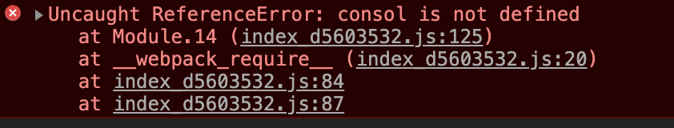
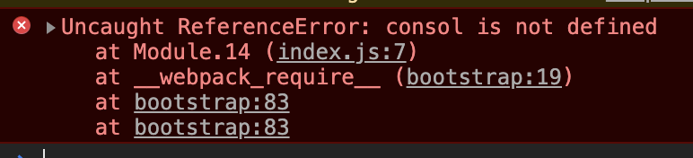
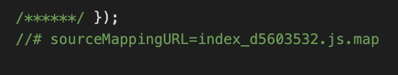

# sourcemap

sourcemap用于定位代码报错位置

### sourcemap使用

可以直接使用* `SourceMapDevToolPlugin`*/*`EvalSourceMapDevToolPlugin` *来替代使用* `devtool` *选项，因为它有更多的选项。切勿同时使用* `devtool` *选项和* `SourceMapDevToolPlugin`*/*`EvalSourceMapDevToolPlugin` *插件。*`devtool` *选项在内部添加过这些插件，所以你最终将应用两次插件。*

### sourcemap配置

##### 开发环境

以下选项非常适合开发环境：

`eval` - 每个模块都使用 `eval()` 执行，并且都有 `//@ sourceURL`。此选项会非常快地构建。主要缺点是，由于会映射到转换后的代码，而不是映射到原始代码（没有从 loader 中获取 source map），所以不能正确的显示行数。

`eval-source-map` - 每个模块使用 `eval()` 执行，并且 source map 转换为 DataUrl 后添加到 `eval()` 中。初始化 source map 时比较慢，但是会在重新构建时提供比较快的速度，并且生成实际的文件。行数能够正确映射，因为会映射到原始代码中。它会生成用于开发环境的最佳品质的 source map。

`cheap-eval-source-map` - 类似 `eval-source-map`，每个模块使用 `eval()` 执行。这是 "cheap(低开销)" 的 source map，因为它没有生成列映射(column mapping)，只是映射行数。它会忽略源自 loader 的 source map，并且仅显示转译后的代码，就像 `eval` devtool。

`cheap-module-eval-source-map` - 类似 `cheap-eval-source-map`，并且，在这种情况下，源自 loader 的 source map 会得到更好的处理结果。然而，loader source map 会被简化为每行一个映射(mapping)。

##### 特定场景

以下选项对于开发环境和生产环境并不理想。他们是一些特定场景下需要的，例如，针对一些第三方工具。

`inline-source-map` - source map 转换为 DataUrl 后添加到 bundle 中。

`cheap-source-map` - 没有列映射(column mapping)的 source map，忽略 loader source map。

`inline-cheap-source-map` - 类似 `cheap-source-map`，但是 source map 转换为 DataUrl 后添加到 bundle 中。

`cheap-module-source-map` - 没有列映射(column mapping)的 source map，将 loader source map 简化为每行一个映射(mapping)。

`inline-cheap-module-source-map` - 类似 `cheap-module-source-map`，但是 source mapp 转换为 DataUrl 添加到 bundle 中。

##### 生产环境

这些选项通常用于生产环境中：

`(none)`（省略 `devtool` 选项） - 不生成 source map。这是一个不错的选择。

`source-map` - 整个 source map 作为一个单独的文件生成。它为 bundle 添加了一个引用注释，以便开发工具知道在哪里可以找到它。

> 你应该将你的服务器配置为，不允许普通用户访问 source map 文件！

`hidden-source-map` - 与 `source-map` 相同，但不会为 bundle 添加引用注释。如果你只想 source map 映射那些源自错误报告的错误堆栈跟踪信息，但不想为浏览器开发工具暴露你的 source map，这个选项会很有用。

> 你不应将 source map 文件部署到 web 服务器。而是只将其用于错误报告工具。

`nosources-source-map` - 创建的 source map 不包含 `sourcesContent(源代码内容)`。它可以用来映射客户端上的堆栈跟踪，而无须暴露所有的源代码。你可以将 source map 文件部署到 web 服务器。

> 这仍然会暴露反编译后的文件名和结构，但它不会暴露原始代码。

> 在使用 `uglifyjs-webpack-plugin` 时，你必须提供 `sourceMap：true` 选项来启用 source map 支持。

### sourcemap 打包结果分析

##### 使用source-map方式打包

所有入口js文件都有一个配套的map文件被打包出来

使用sourcemap前

使用sourcemap后

在使用sourcemap后可以找到报错的代码在源码中的位置

在bundle文件结尾有相应的map文件链接

##### 使用inline-source-map打包

将map文件打包进bundle文件中，会增加bundle文件体积，肯定不能用于生产环境