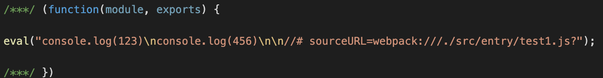
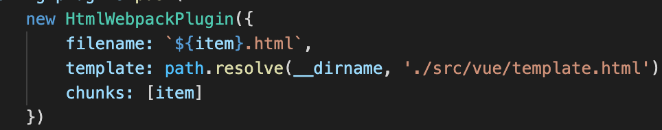
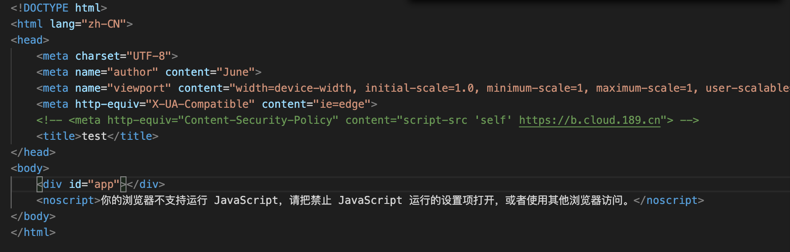
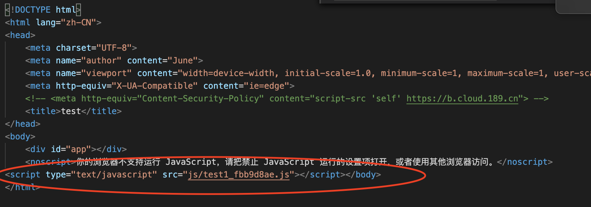
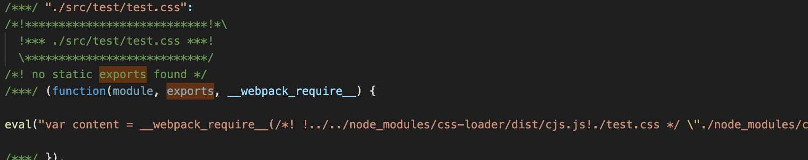

# webpack打包结果分析

### 1.webpack常用配置和概念

##### 占位符

[name] : 打包的文件名

[hash:X] : 当代码发生改动时触发更新

某一个文件发生改变，则所有的hash都会发生变化，在小规模改动时效率低

[chunkhash:X] : 当chunk发生变化，chunk相关的hash会发生变化

某一个文件发生改变,所有处于同一个chunk对应的bundle文件hash都会发生变化

[contenthash:X] : 当自身内容发生变化时触发更新

自身的内容更新只会影响自身作的bundle文件，其他文件hash不会更新，最大限度利用浏览器的缓存

其实三者主要也是影响颗粒度的问题

##### mode

标示打包模式

None: 大部分plugin不开启

Production: 开启部分利于线上部署的plugin（例如压缩等）

Development: 开启部分利于开发的plugin

##### loader

https://www.webpackjs.com/loaders/

见loader.md文件

##### plugin

插件，实现一些功能

(待展开)

##### module

模块文件： 参与打包的各个文件都可以称之为module

##### bundle

输出的资源文件就叫bundle文件，其中的chunk组成一个chunks

##### Chunk

代码片段（比如被打包过后生成的那些通过eval执行的代码片段）

##### modlue bundle chunk chunks的关系

一个chunks可以对应一个或多个module

一个bundle对应一个chunks, 对应一个或者多个chunk(bundle不等于chunks, bundle中还包含启动函数等内容)

### 2.webpack打包后的自执行函数

##### 自执行函数的传入参数（modules）

webpack打包成一个自执行函数，传入一个对象作为自执行函数的参数

如图所示，“6”作为对象的key，对象的值为一个函数

##### 自执行函数的本体

创建了__webpack_require__函数

__webpack_require__函数中通过modules[moduleId].call(module.exports, module, module.exports, __webpack_require__);调用传入对象中的函数

通过return __webpack_require__(__webpack_require__.s = 6);尾回调函数调用

##### js代码的引入打包

a.js调用了b.js中的函数，以a.js作为入口，则b.js中的函数和a.js中的主函数会被打包成两个chunk, 都在默认参数modules对象中传入并赋不同的key值，通过__webpack_require__（moduleId）调用

自执行函数尾回调a.js的chunk, b.js中的chunk被以__webpack_require__（bKey）的形式在a.js的chunk中调用 

### 3.HtmlWebpackPlugin中代码引入状态

从template参数中找到模版文件，根具chunks找到引入对应的chunks的相关bundle文件，打包成filename所指示的html文件名

模版中的代码

打包后生成的html文件代码

直接在html中加入了被打包的代码，从而执行自执行函数，调用被打包前js中的文件

### 4.css的打包过程

##### css-loader

`css-loader` 解释(interpret) `@import` 和 `url()` ，会 `import/require()` 后再解析(resolve)它们。

使用该loader，可以解析出@import，url()，require()引入的css代码,并将其以eval函数的形式打包为一个chunk

在打包后的文件中发现了’./src/test/test.css‘名字的chunk字段，

但是单独使用css-loader，引入的css代码并没有生效，还需要style-loader

##### style-loader

Adds CSS to the DOM by injecting a `<style>` tag

将css插入DOM元素

用该loader处理css-loader处理后的数据，可以引入的css代码回插入到引入该bundle的html文件的header中,

在打包文件中多了一些chunk片段，并且能发现插入的代码

##### MiniCssExtractPlugin

使用了MiniCssExtractPlugin.loader替代style-loader，可以将css文件进行独立拆分打包

此时’./src/test/test.css‘名字的chunk字段的eval也没有内容

##### less和less-loader

Less-loader用于发现找到less代码，less模块负责编译处理less代码，两者共同完成less代码到css代码到处理

##### postcss-loader

Posts-loadr是webpack和postcss-loader通信的工具插件