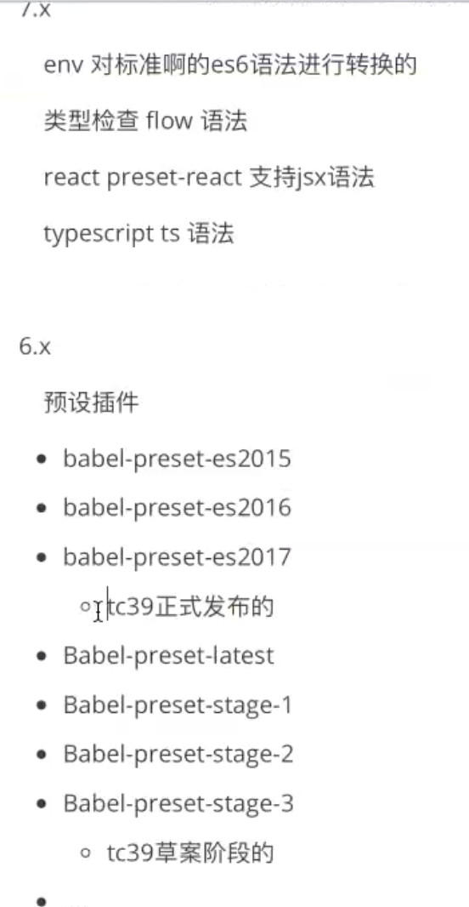

# webpack实战知识点

### npmrc

npm gets its config settings from the command line, environment variables, and `npmrc` files.

可以在其中指定registry=https://registry.npm.taobao.org 来规范使用统一npm源进行下载，而不用手动切换或借助nrm

Npm-config详细命令： https://www.npmjs.cn/misc/config/


### postcss

postcss配置文件： 根目录下postcss.config.js

在配置文件下以如下方式引入插件，

```
module.exports = {
  plugins: [
    require('autoprefixer'),
    require('postcss-nested')
  ]
}
```

webpack中使用需要添加postcss-loader进行通行<font color="red">（postcss-loader写在css-loader之后，less-loader之前)</font>

文档： https://github.com/postcss/postcss


### browserslistrc

浏览器的兼容配置文件，数据来自于Can I Use，为了给一些插件作为配置使用

例如使用autoperfixer插件，会先从option -> package.json中的browserslist字段 -> .browserslistrc文件中查找浏览器配置，再给css代码添加上相应的头字段 

<font color='red'>npx browserslist '条件' 可以展示出符合该条件的浏览器版本</font>

文档： https://browserl.ist/ （停止维护）


### babel.config.json | .babelrc

Babel 是一个工具链，主要用于将 ECMAScript 2015+ 版本的代码转换为向后兼容的 JavaScript 语法，以便能够运行在当前和旧版本的浏览器或其他环境中。

##### 处理器

@Babel/preset-env: 处理js语法

Polypill: 处理js语法新特新

<font color='red'>使用useBuiltIns字段可以对ploypill按需加载，否则ploypill中包含了所有的语法新特新，导致打包结果过大</font>

官网https://www.babeljs.cn/

##### config中字段

Presets： 预设插件（语法解析）

plugins: 插件

##### 版本变化




6.x版本的预设插件需要根据es的不同版本引入不同的预设

7.x版本的@babel/preset-env代替了6.x中的一众预设插件