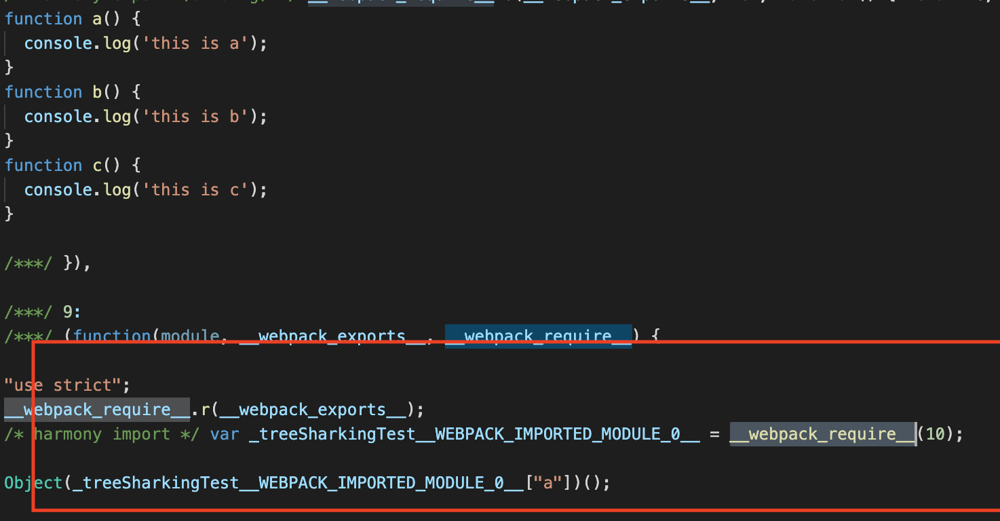
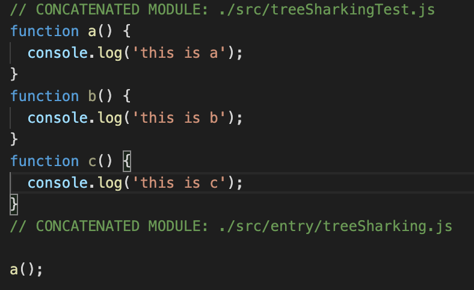

# scope hositing优化

### 1.scope hositing原理

webpack将所有的import引入的函数，打包成__webpack_require__（）这种形式，到时打包结果代码中产生非常多的包裹闭包函数

将所有模块代码按照引用顺序放在一个函数作用域中，然后适当的重命名变量以防止变量名冲突

通过scope hoisting可以减小函数声明代码和内存开销

### 2.scope hositing调用

webpack3

增加 new ModuleConcatenationPlugin() 插件

webapck4

mode： production中默认开启该配置

使用前

使用后

可以发现，使用scope hoisting后，红框中的a函数的调用和a函数的声明被放入同一个作用域了，从而大大减小代码量