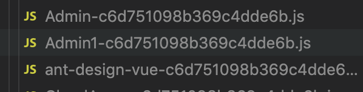
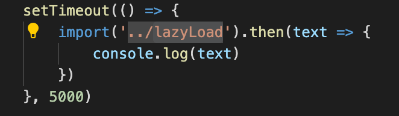

# 懒加载

### vue中的懒加载

##### 问题

webpack按照router的引入方式进行打包，会将所有的js文件打包至同一个bundle文件下，非常影响性能

##### 解决方案

使用如下写法

component: () => import(/* webpackChunkName: "Admin" */ '@/views/admin/manageMember/adminPermissions/Index')

webpack会讲同一个webpackChunkName的模块打包成同一个bundle，从而完成按需引入，优化首屏幕等性能

### 代码分割

commonJS： require.ensure

ES6: 动态import(目前没有原生支持，需要babel转换)

##### 动态import

使用@babel/plugin-syntax-dynamic-import 这个babel插件 (通过jsonp插入)

使用可以使用import()的方法引入脚本，返回一个promise

可以看到,有一个单独的js文件被打包，该文件在import执行的时候，通过jsonp的方式引入加载

