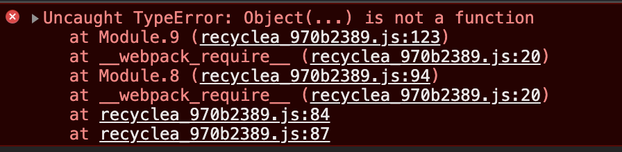

# commonjs和es6模块打包分析

### 1.cjs和es6打包结果区别

CommonJS 模块输出的是一个值的拷贝，ES6 模块输出的是值的引用。
CommonJS 模块是运行时加载，ES6 模块是编译时输出接口。

### 2.es6打包分析

##### 打包前代码

a.js源码

```javascript
import {show, change} from './recycleb'
show()
change()
show()
```

b.js源码

```javascript
let recycleb = 'this is recycleb'
export function show () {
    console.log(recycleb)
}
export function change () {
    recycleb = 'this is another recycleb'
}
```

##### 打包后代码

在webpack执行体最后执行如下代码,也就是a.js模块

```javascript
return __webpack_require__(__webpack_require__.s = 8);
```

webpack_require函数

```javascript
/******/ 	function __webpack_require__(moduleId) {
/******/
/******/ 		// Check if module is in cache
/******/ 		if(installedModules[moduleId]) {
/******/ 			return installedModules[moduleId].exports;
/******/ 		}
/******/ 		// Create a new module (and put it into the cache)
/******/ 		var module = installedModules[moduleId] = {
/******/ 			i: moduleId,
/******/ 			l: false,
/******/ 			exports: {}
/******/ 		};
/******/
/******/ 		// Execute the module function
/******/ 		modules[moduleId].call(module.exports, module, module.exports, __webpack_require__);
/******/
/******/ 		// Flag the module as loaded
/******/ 		module.l = true;
/******/
/******/ 		// Return the exports of the module
/******/ 		return module.exports;
/******/ 	}
```

<font color='red'>其中定义了installedModules对象用来缓存，如果缓存中没有，则执行对应的chunk代码，所以可以看出，被引入的模块所在的代码会被执行一次</font>

installedModules中的exports用来存储import输出的函数或变量

a.js模块

```javascript
/***/ 8:
/***/ (function(module, __webpack_exports__, __webpack_require__) {

"use strict";
__webpack_require__.r(__webpack_exports__);
/* harmony import */ var _recycleb__WEBPACK_IMPORTED_MODULE_0__ = __webpack_require__(9);

Object(_recycleb__WEBPACK_IMPORTED_MODULE_0__["show"])();
Object(_recycleb__WEBPACK_IMPORTED_MODULE_0__["change"])();
Object(_recycleb__WEBPACK_IMPORTED_MODULE_0__["show"])();

/***/ }),
```


发现a.js模块中，先执行了__webpack__require__.r函数

Webpackrequire.r函数: ???

```javascript
// define __esModule on exports
/******/ 	__webpack_require__.r = function(exports) {
/******/ 		if(typeof Symbol !== 'undefined' && Symbol.toStringTag) {
/******/ 			Object.defineProperty(exports, Symbol.toStringTag, { value: 'Module' });
/******/ 		}
/******/ 		Object.defineProperty(exports, '__esModule', { value: true });
/******/ 	};
```


执行了__webpack_require__(9)也就是b.js模块，并从中获取了show和change函数

b.js模块

```javascript
/***/ 9:
/***/ (function(module, __webpack_exports__, __webpack_require__) {

"use strict";
__webpack_require__.r(__webpack_exports__);
/* harmony export (binding) */ __webpack_require__.d(__webpack_exports__, "show", function() { return show; });
/* harmony export (binding) */ __webpack_require__.d(__webpack_exports__, "change", function() { return change; });
var recycleb = 'this is recycleb';
function show() {
  console.log(recycleb);
}
function change() {
  recycleb = 'this is another recycleb';
}

/***/ })
```


使用webpack_require.d函数，向webpack_exports中写入了show方法和change方法（工厂模式）

Webpack_require.d

```javascript
/******/ 	__webpack_require__.d = function(exports, name, getter) {
/******/ 		if(!__webpack_require__.o(exports, name)) {
/******/ 			Object.defineProperty(exports, name, { enumerable: true, get: getter });
/******/ 		}
/******/ 	};
```

Web pack_require.o: 判断exports中是否已经写入该函数

```javascript
__webpack_require__.o = function(object, property) { return Object.prototype.hasOwnProperty.call(object, property); };
```

<font color='red'>由此可以看出，多次export同名模块，只有第一次export有效</font>(实际操作的时候报错了)

##### 覆盖操作

覆盖前代码

```javascript
console.log(name)
name = 'recyclea'
console.log(name)
```

打包后代码

```javascript
console.log(_recycleb__WEBPACK_IMPORTED_MODULE_0__["name"]);
name = 'recyclea';
console.log(name);
```


### 3.cjs打包分析

##### 打包前代码

a.js源码

```javascript
let {show, change, name} = require('./recycleb')
show()
change()
show()
console.log(name)
name = 'recyclea'
console.log(name)
```

b.js源码

```javascript
function show () {
        console.log(recycleb)
    }
function change () {
    recycleb = 'this is another recycleb'
}
function change2 () {
    recycleb = 'this is another recycleb2'
}
var name = 'recycleb';
module.exports = {
    show,
    change,
    change2,
    name
}
```

##### 打包后代码

a.js打包后的代码

```javascript
/***/ 8:
/***/ (function(module, exports, __webpack_require__) {

var _require = __webpack_require__(9),
    show = _require.show,
    change = _require.change,
    name = _require.name;

show();
change();
show();
console.log(name);
name = 'recyclea';
console.log(name);

/***/ }),
```

b.js打包后的代码

```javascript
/***/ 9:
/***/ (function(module, exports) {

var recycleb = 'this is recycleb'; // export function show () {

function show() {
  console.log(recycleb);
}

function change() {
  recycleb = 'this is another recycleb';
}

function change2() {
  recycleb = 'this is another recycleb2';
}

var name = 'recycleb';
module.exports = {
  show: show,
  change: change,
  change2: change2,
  name: name
};

/***/ })

/******/ });
```

<font color='red'>可以看出，require打包是将函数或者值直接插入到module.exports中，而import是插入到工厂函数，返回那个值</font>

### 4.交叉引入原理

首先在a.js和b.js互相引入，并且调用其中函数

运行报错如下



##### 过程分析

调用webpack_require(8)（a.js）-> 

在installedModules中加入8的缓存，此时export为空，运行8中chunk代码 -> 

调用webpack_require(9) (b.js) -> 在installedModules加入9的缓存，运行9中chunk代码 -> 

调用webpack_require(8)（a.js）->此时直接从从installedModules取出8的exports返回，但是是一个空对象

```javascript
Object(_recyclea__WEBPACK_IMPORTED_MODULE_0__["default"])()
```

该对象中找不到default的值，返回undefine, undefine当作函数调用所以产生上述错误，遇见时需要注意