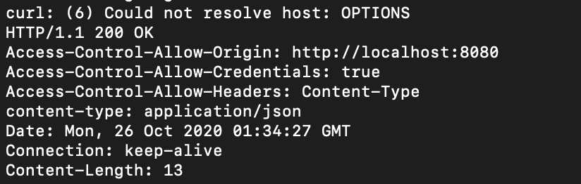

# 腾讯一面

### 1. CORS跨域无法携带cookie和options预检请求问题

官网文档：https://developer.mozilla.org/zh-CN/docs/Web/HTTP/Access_control_CORS

##### XMLHttpRequest对象

`XMLHttpRequest`（XHR）对象用于与服务器交互。通过 XMLHttpRequest 可以在不刷新页面的情况下请求特定 URL，获取数据。这允许网页在不影响用户操作的情况下，更新页面的局部内容。`XMLHttpRequest` 在 [AJAX](https://developer.mozilla.org/zh-CN/docs/Glossary/AJAX) 编程中被大量使用。

##### fetch API

The Fetch API provides an interface for fetching resources (including across the network). It will seem familiar to anyone who has used [`XMLHttpRequest`](https://developer.mozilla.org/en-US/docs/Web/API/XMLHttpRequest), but the new API provides a more powerful and flexible feature set.

和XMLHttpRequest类似，但是提供了一套全新的api

##### Options预检请求

在 [CORS](https://developer.mozilla.org/zh-CN/docs/Web/HTTP/Access_control_CORS) 中，可以使用 OPTIONS 方法发起一个预检请求，以检测实际请求是否可以被服务器所接受。预检请求报文中的 [`Access-Control-Request-Method`](https://developer.mozilla.org/zh-CN/docs/Web/HTTP/Headers/Access-Control-Request-Method) 首部字段告知服务器实际请求所使用的 HTTP 方法；[`Access-Control-Request-Headers`](https://developer.mozilla.org/zh-CN/docs/Web/HTTP/Headers/Access-Control-Request-Headers) 首部字段告知服务器实际请求所携带的自定义首部字段。服务器基于从预检请求获得的信息来判断，是否接受接下来的实际请求。

可以使用如下代码，发送OPTIONS请求

```
curl OPTIONS localhost:8001 -i
```

返回结果如下



<font color='red'>Access-Control-Allow-Origin表示CORS允许访问的origin</font>

<font color='red'>Access-Control-Allow-Headers表示CORS允许访问的额外携带的Header</font>

<font color='red'>Access-Control-Allow-Methods表示CORS允许使用的Methods(这里没有设置，所以没有)</font>

<font color='red'>Access-Control-Allow-Credentials表示是否可以携带cookie</font>

##### 简单请求和复杂请求

同时满足以下条件，就是简单请求：

1.使用下列方法之一：GET, POST, HEAD<font color='red'>可以用Access-Control-Allow-Headers添加</font>

2.header中只能存放一些默认的头字段<font color='red'>可以用Access-Control-Allow-Headers添加</font>

3.Content-type的值仅限于下列三者之一：text/plain, multipart/form-data ,application/x-www-form-urlencoded

非简单请求
不满足简单请求的则为非简单请求

<font color='red'>简单请求不会触发cors预检（即发送OPTIONS请求）</font>

##### CORS携带cookie的方法

前端：请求中携带withCredentials=ture参数

后端：相应头中Access-Control-Allow-Credentials设置为true


### 2.上下文执行栈

##### 执行栈种类

全局执行栈：window对象

函数执行栈：调用函数时创建

eval执行栈

##### 执行栈创建过程

1.创建this

​	全局执行栈的this指向window

​	而在函数执行上下文中，this的值取决于函数的调用方式，如果被一个对象调用，那么this指向这个对象。

2.创建词法环境组件

​	环境记录: 其中环境记录用于存储当前环境中的变量和函数声明的实际位置

​	外部环境引入记录:用于保存自身环境可以访问的其它外部环境(作用域链)

3.创建变量环境组件

变量环境可以说也是词法环境，它具备词法环境所有属性，一样有环境记录与外部环境引入。在ES6中唯一的区别在于词法环境用于存储函数声明与let const声明的变量，而变量环境仅仅存储var声明的变量。

##### 其他内容

1.使用先入后出的方式实现，全局执行栈（window）在栈道最下面，也就是一直存在


### 3.  当setInterval回调函数的执行时间比指定的时间间隔长时的代码执行逻辑

如果setInterval回调函数的执行时间将足够长（比指定的时间间隔长），它们将连续执行并且彼此之间没有时间间隔。（按照event loop模式，主执行队列的内容还没有被执行完，就有多个setInterval回调函数加载宏任务队列了，这些执行将会没有间隔）

<font color='red'>一个耗时长位置的模块，如何实现setInterval每隔固定时间调用一次？？？？？？？</font>

### 4. 垃圾回收机制的实现方法

##### 垃圾回收过程

1.垃圾回收器获取根应用

2.便利并且标记根应用的子应用（标记是为了不重复便利相同的节点，防止出现循环引用的情况）

3.这个操作结束后，遍历堆，没有标记到的节点就是不可访问的节点，被垃圾回收器回收

4.做内容整理，清除碎片

（要口头说明具体算法实现）

[垃圾回收算法]( https://www.jianshu.com/p/a8a04fd00c3c)

##### 垃圾回收优化

1.闲时回收：cpu空闲时执行

2.增量回收：存在越久的变量执行回收流程越小

3.分代回收：将所有内容拆分成多个模块进行垃圾回收，不用一次性便利完


##### 5.csrf攻击流程

受害者 Bob 在银行有一笔存款，通过对银行的网站发送请求 http://bank.example/withdraw?account=bob&amount=1000000&for=bob2 可以使 Bob 把 1000000 的存款转到 bob2 的账号下。通常情况下，该请求发送到网站后，服务器会先验证该请求是否来自一个合法的 session，并且该 session 的用户 Bob 已经成功登陆。

​    黑客 Mallory 自己在该银行也有账户，他知道上文中的 URL 可以把钱进行转帐操作。Mallory 可以自己发送一个请求给银行：http://bank.example/withdraw?account=bob&amount=1000000&for=Mallory。但是这个请求来自 Mallory 而非 Bob，他不能通过安全认证，因此该请求不会起作用。

​    这时，Mallory 想到使用 CSRF 的攻击方式，他先自己做一个网站，在网站中放入如下代码： src=”http://bank.example/withdraw?account=bob&amount=1000000&for=Mallory ”，并且通过广告等诱使 Bob 来访问他的网站。当 Bob 访问该网站时，上述 url 就会从 Bob 的浏览器发向银行，而这个请求会附带 Bob 浏览器中的 cookie 一起发向银行服务器。大多数情况下，该请求会失败，因为他要求 Bob 的认证信息。但是，如果 Bob 当时恰巧刚访问他的银行后不久，他的浏览器与银行网站之间的 session 尚未过期，浏览器的 cookie 之中含有 Bob 的认证信息。这时，悲剧发生了，这个 url 请求就会得到响应，钱将从 Bob 的账号转移到 Mallory 的账号，而 Bob 当时毫不知情。等以后 Bob 发现账户钱少了，即使他去银行查询日志，他也只能发现确实有一个来自于他本人的合法请求转移了资金，没有任何被攻击的痕迹。而 Mallory 则可以拿到钱后逍遥法外。 

（只关心预防攻击方法结果在攻击流程上没有打出来）


### 6.非注入式的监测图片加载失败 / 错误监控问题

使用全局onerror事件监听


### 7.移动端相关问题

[移动端相关问题解决方案](https://github.com/suoyuesmile/suo-blog/blob/master/articals/h5/0003.md)

